#ServletsTutorial
Tutorial de introducción a los Java Servlets para la asignatura 
de **_Acceso a Datos_ de 2º de CFGS de Desarrollo de Aplicaciones M
Multiplataforma**
## Preparando el entorno
Para crear el proyecto vamos a usar Netbeans IDE y el servidor de 
aplicaciones J2EE Tomcat.
Partimos que ya hemos descargado e instalado NetBeans.

## Creando el proyecto
Seleccionamos el menú **File-> New project**
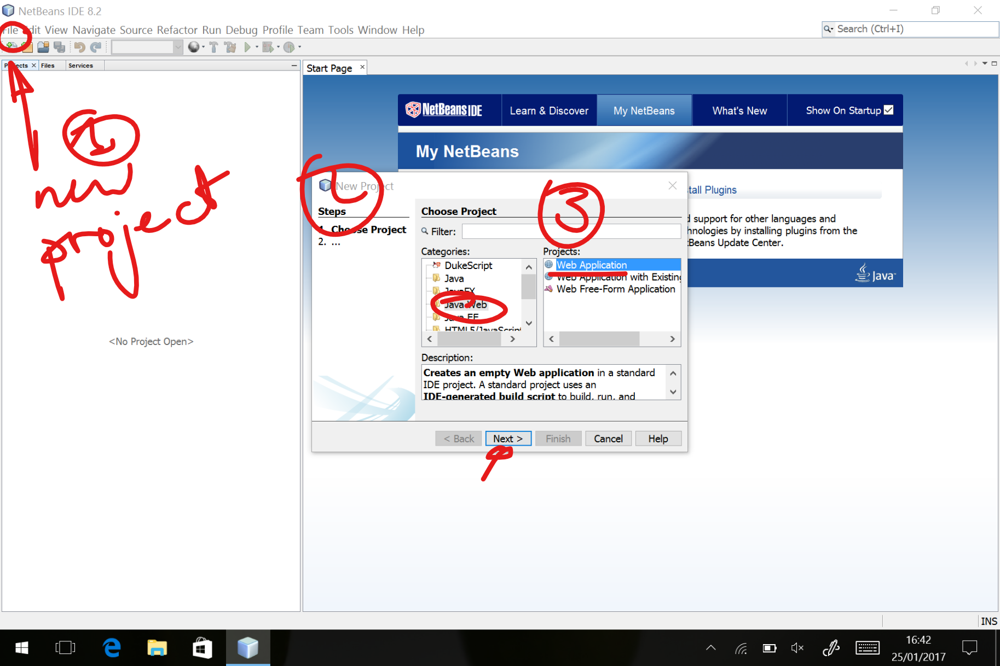
Ahora le damos un nombre al proyecto y seleccionamos dónde queremos
guardarlo en nuestro disco duro. Pulsamos **Next**.
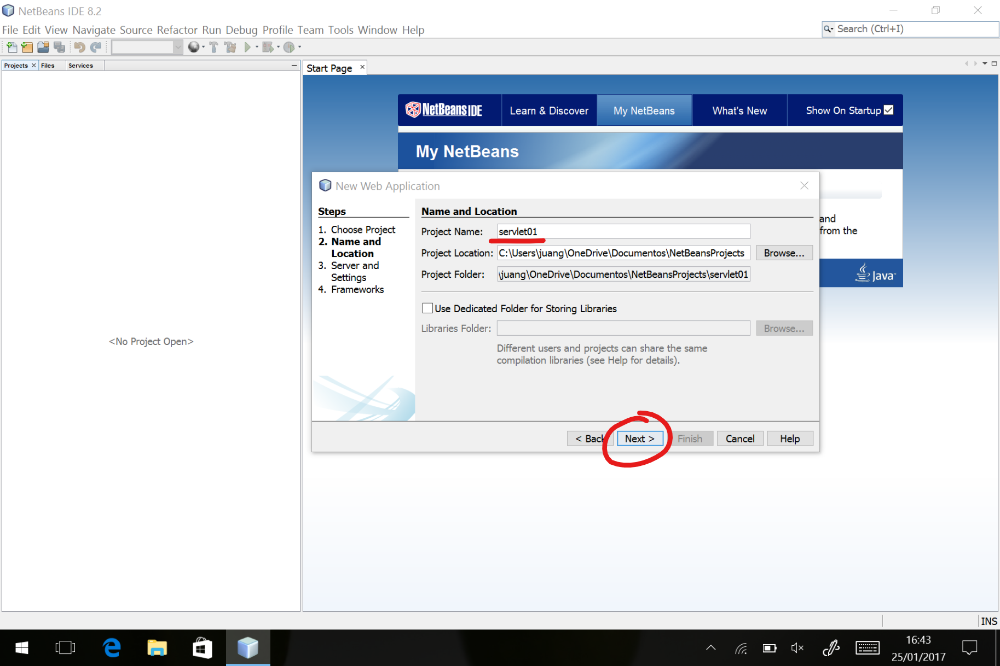
### Selección del contenedor(servidor) J2EE.
Como es una aplicación J2EE, necesitamos instalar un servidor de 
aplicaciones. Por defecto NetBeans ofrece GlassFish, pero nosotros
vamos a ver [Apache Tomcat ](https://tomcat.apache.org) aquí.

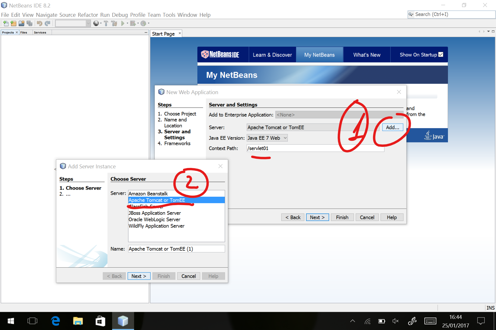

### Descarga e instalación de Tomcat.
Antes de continuar, deberemos [descargar y configurar Apache Tomcat de
su Web oficial ](http://tomcat.apache.org/download-80.cgi#8.5.11). 
En nuestro caso nos decantamos por la versión 8.5.XX.
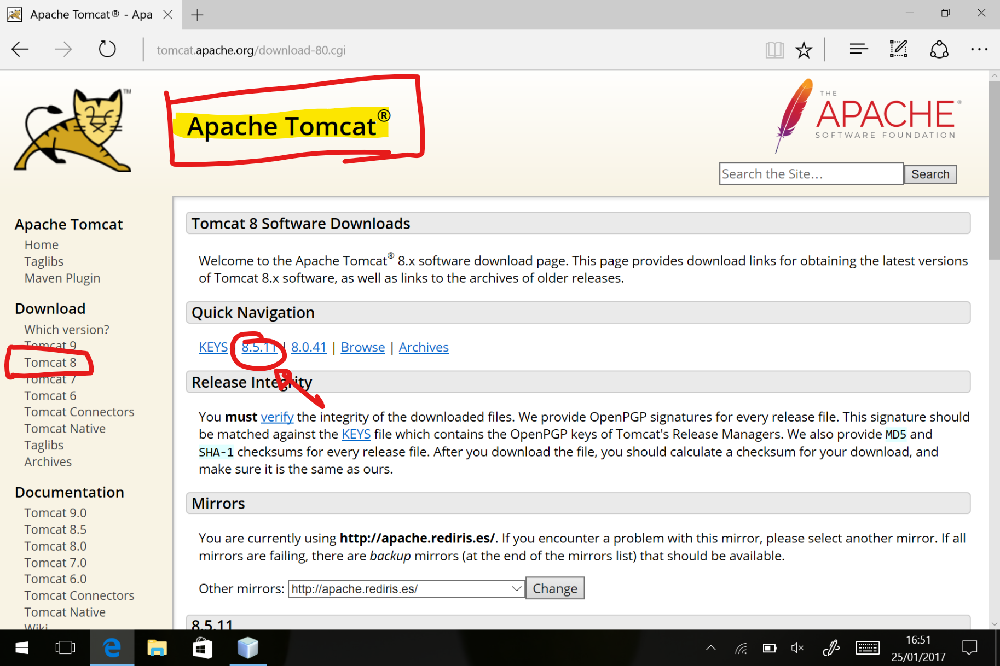
Seleccionamos el "tar.gz" si estamos en un sistema \*NIX o MAC y el ZIP en 
Windows.
Descargamos y descomprimimos en nuestra carpeta de trabajo. No es necesaria
instalación y es mejor así para mantener el equipo más limpio.
Si quieres desacerte de Tomcat al terminar el tutorial, sólo has de eliminar
la carpeta y ¡listo!.
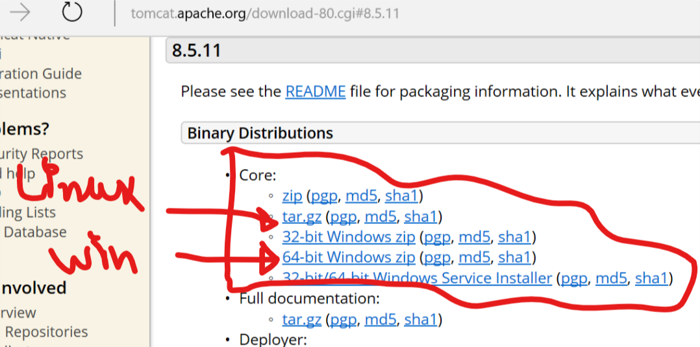
Una vez descomprimido, hemos de configurar el acceso de administrador para
poder subir aplicaciones (ficheros WAR) al servidor. Para ello editamos el 
fichero **tomcat-users.xml** que está en la carpeta **_conf_**.
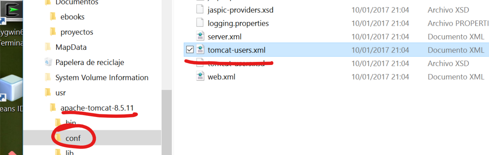
Añadimos la siguiente línea en el fichero **tomcat-users.xml**. Asegúrate de
hacerlo dentro del nodo raíz "tomcat-users" del fichero XML:
```xml 
<user username="tomcat" password="tomcat" roles="admin, manager-gui"/>
```
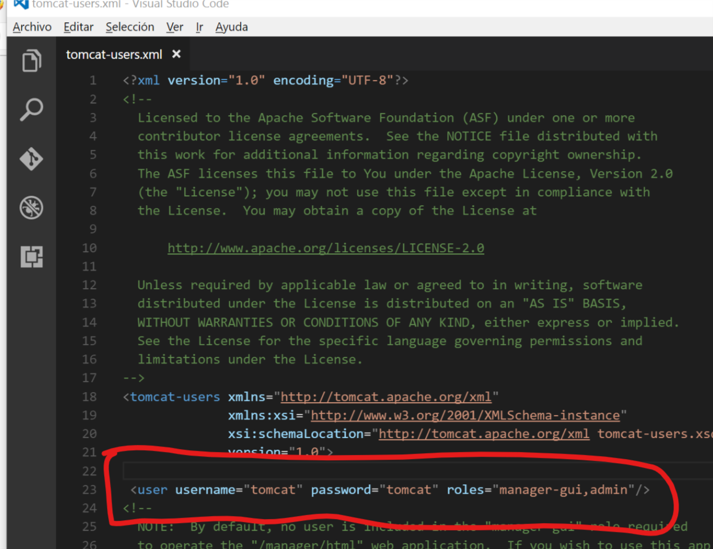
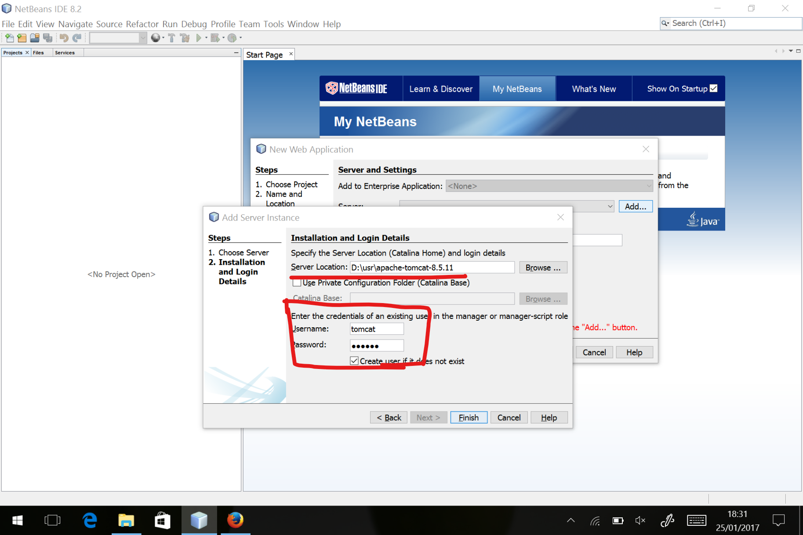
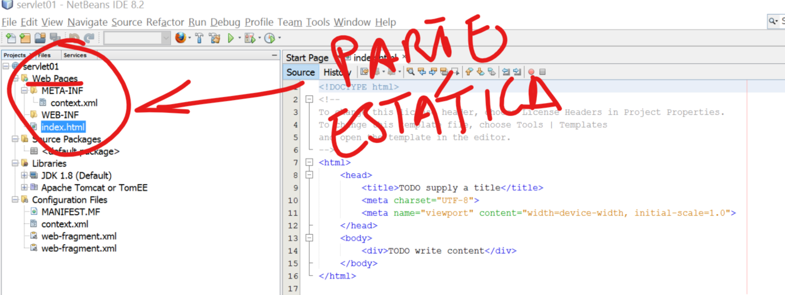
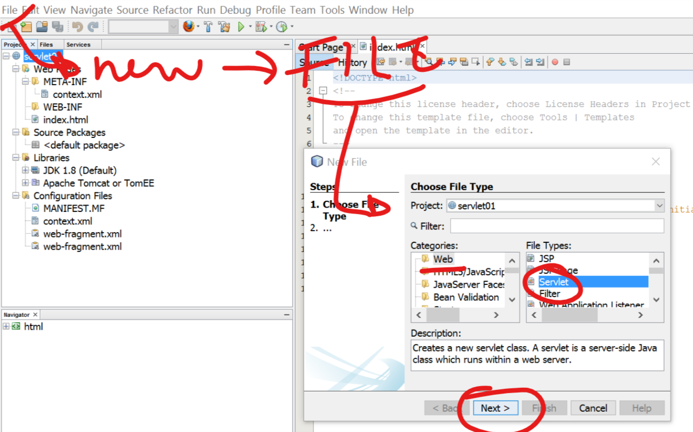
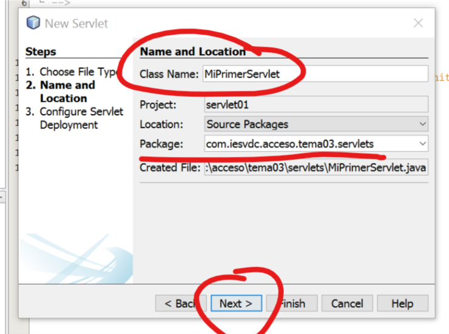

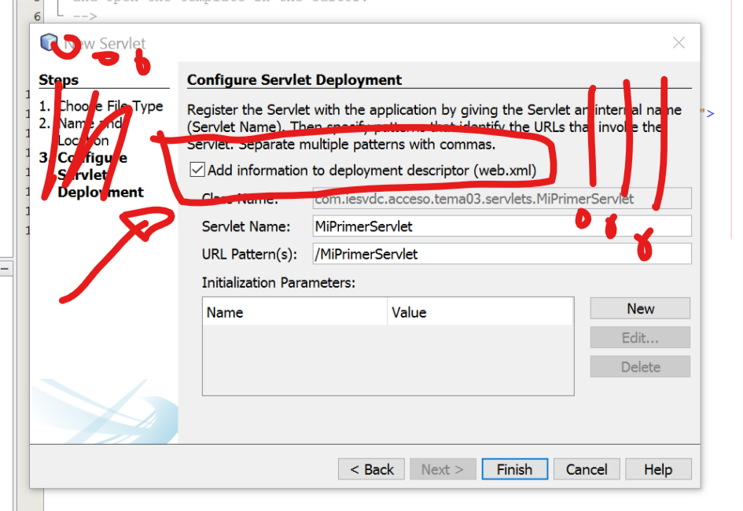
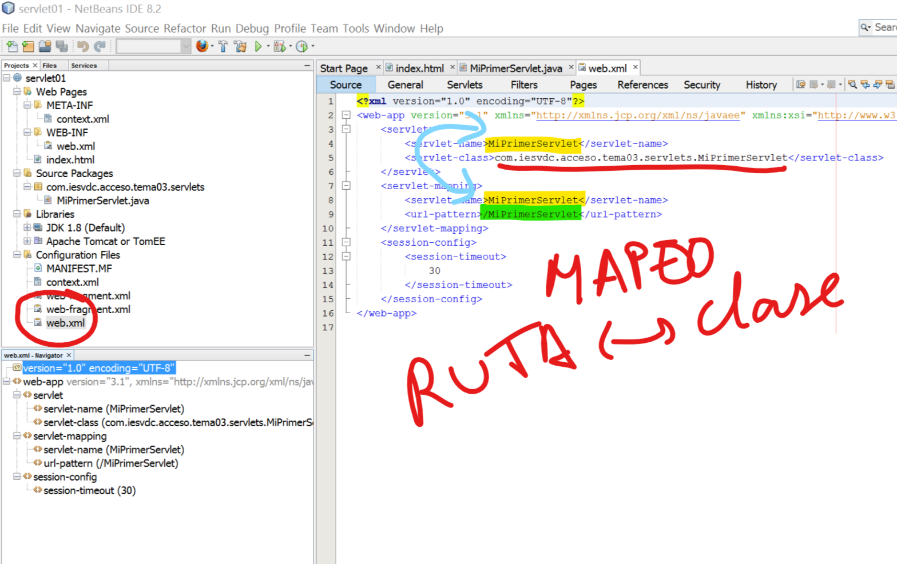
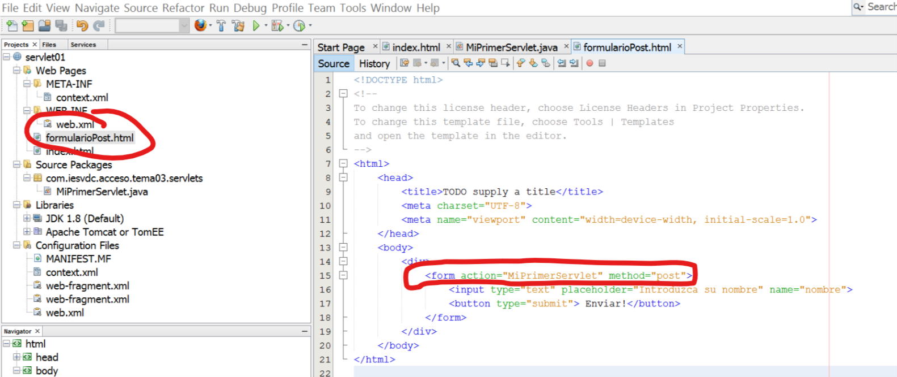
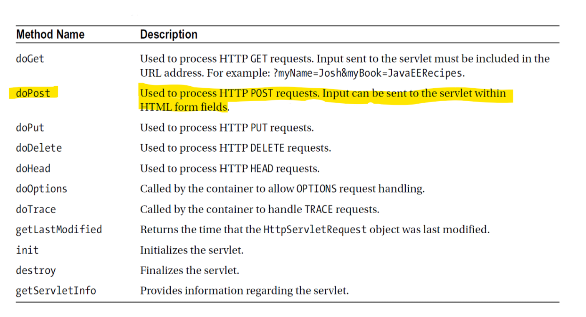
