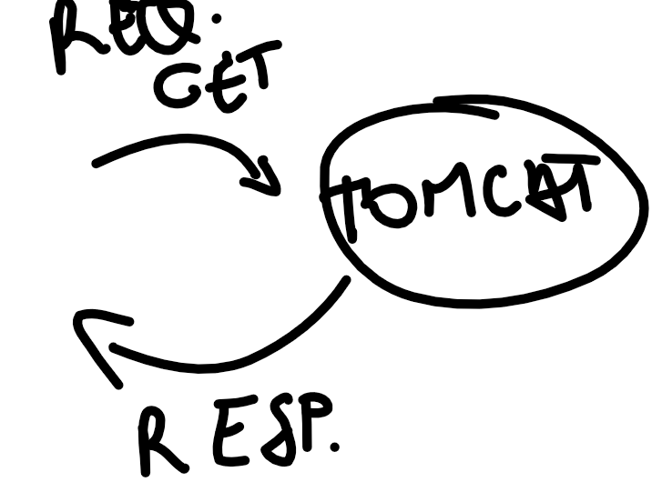
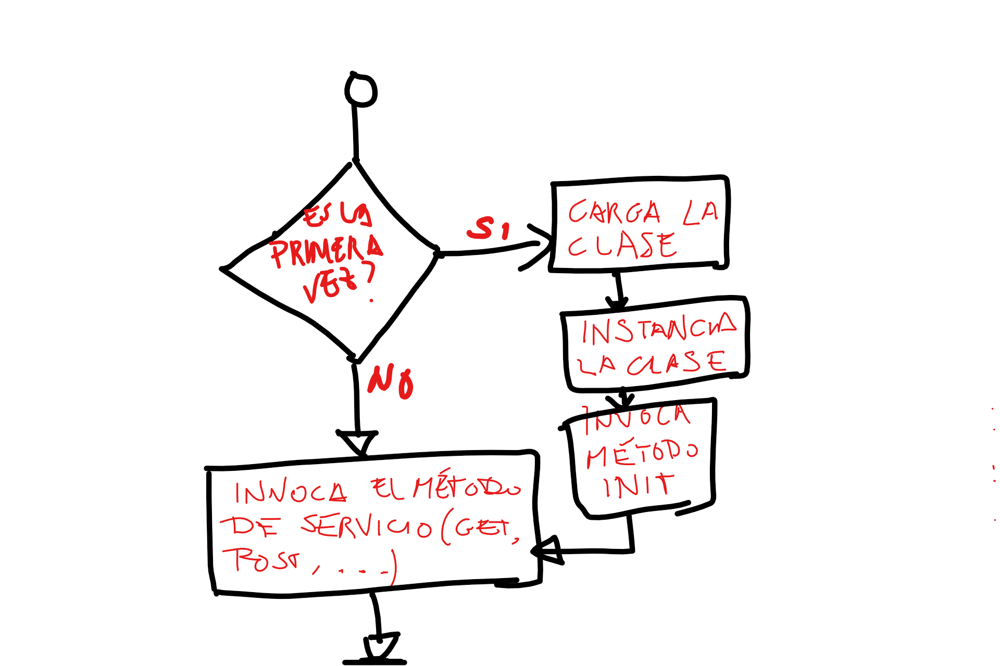

#ServletsTutorial

Tutorial de introducción a los Java Servlets para la asignatura 
de **_Acceso a Datos_ de 2º de CFGS de Desarrollo de Aplicaciones
Multiplataforma**

## ¿Cómo funciona un servlet?

Hasta ahora hemos creado aplicaciones J2SE, es decir aplicaciones para
ejecutar en el equipo local.

Un **servlet** por sí mismo no tiene capacidad de ejecutarse, no tenemos
un método _main_ como hasta ahora.

El **servlet** se ejecuta dentro de un **_contenedor_** que es un 
servidor de aplicaciones. El contenedor será la verdadera aplicación
que responde a las peticiones de los clientes (por ejemplo servicios REST, 
HTTP, etc.).



En función de _**la ruta de acceso al recurso**_ el servidor de aplicaciones
cargará una u otra aplicación.




La primera vez que se invoque la ruta de nuestro servlet, éste será cargado 
e inicializado. Las siguientes veces ya estará en memoria y un hilo de ejecución
invocará el método correspondiente.


## Preparando el entorno

Para crear el proyecto vamos a usar Netbeans IDE y el servidor de 
aplicaciones J2EE Tomcat.

Partimos que ya hemos descargado e instalado NetBeans.


## Creando el proyecto
Seleccionamos el menú **File-> New project**.


Ahora le damos un nombre al proyecto y seleccionamos dónde queremos
guardarlo en nuestro disco duro. Pulsamos **Next**.


### Selección del contenedor(servidor) J2EE.
Como es una aplicación J2EE, necesitamos instalar un servidor de 
aplicaciones. Por defecto NetBeans ofrece GlassFish, pero nosotros
vamos a ver [Apache Tomcat ](https://tomcat.apache.org) aquí.


### Descarga e instalación de Tomcat.

Antes de continuar, deberemos [descargar y configurar Apache Tomcat de
su Web oficial ](http://tomcat.apache.org/download-80.cgi#8.5.11). 

En nuestro caso nos decantamos por la versión 8.5.XX.

Seleccionamos el "tar.gz" si estamos en un sistema \*NIX o MAC y el ZIP en 
Windows.

Descargamos y descomprimimos en nuestra carpeta de trabajo. No es necesaria
instalación y es mejor así para mantener el equipo más limpio.

Si quieres desacerte de Tomcat al terminar el tutorial, sólo has de eliminar
la carpeta y ¡listo!.


Una vez descomprimido, hemos de configurar el acceso de administrador para
poder subir aplicaciones (ficheros WAR) al servidor. Para ello editamos el 
fichero **tomcat-users.xml** que está en la carpeta **_conf_**.


Añadimos la siguiente línea en el fichero **tomcat-users.xml**. Asegúrate de
hacerlo dentro del nodo raíz "tomcat-users" del fichero XML:
```xml 
<user username="tomcat" password="tomcat" roles="admin, manager-gui"/>
```


###Introducimos en NetBeans el usuario y contraseña de Tomcat
Continuamos con el proyecto: indicamos a NetBeans el directorio donde
hemos descargado y configurado Tomcat así como el usuario y contraseña 
para el acceso al servidor de aplicaciones.


###Estructura de nuestro proyecto Web con Servlets

En el directorio _**Web Pages**_ podemos colgar cualquier elemento estático
que necesitemos (código JavaScript, CSS, formularios estáticos, etc.).


### Añadiendo el primer servlet
